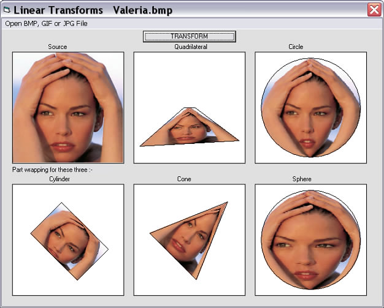



## Linear Transforms 2 \(Update 25 Jan 08\)

### Description

Linear Transforms by Robert Rayment... Shows mapping a rectangular image onto a quadrilateral, circle, cylinder, cone and a sphere... This is re-worked from an old program of mine to speed it up and make more re-useable... Note that for the cylinder, cone and the sphere the image is only partly wrapped around... Five images are included... Only tested on Win XP... (Update 23 Jan 08)... Some redundant maths lines removed...(Update 25 Jan 08)... Simplified CommonDialog info and indicated where color bytes could be manipulated...Zip 185 KB.
 
### More Info
 
Picture

Just run

             |
---                |---
**Submitted On**   |2008-01-18 19:00:30
**By**             |[Robert Rayment](https://github.com/Planet-Source-Code/PSCIndex/blob/master/ByAuthor/robert-rayment.md)
**Level**          |Beginner
**User Rating**    |4.9 (69 globes from 14 users)
**Compatibility**  |VB 6\.0
**Category**       |[Graphics](https://github.com/Planet-Source-Code/PSCIndex/blob/master/ByCategory/graphics__1-46.md)
**World**          |[Visual Basic](https://github.com/Planet-Source-Code/PSCIndex/blob/master/ByWorld/visual-basic.md)
**Archive File**   |[Linear\_Tra2099131252008\.zip](https://github.com/Planet-Source-Code/robert-rayment-linear-transforms-2-update-25-jan-08__1-69937/archive/master.zip)

### API Declarations

A few, see code.

